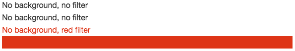
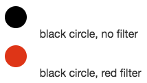

<h1 align="center">Polaris design tokens</h1>


<h3 align="center">Colors, spacing, animation, and typography for all platforms</h3>

<p align="center"><em>JavaScript · JSON · CSS · SCSS · Android · Sketch · macOS · iOS · Adobe Swatch</em></p>

<div align="center" markdown="1">

[](https://www.npmjs.com/package/@shopify/polaris-tokens) [](https://travis-ci.com/Shopify/polaris-react)

</div>

---

[Design tokens](https://medium.com/eightshapes-llc/tokens-in-design-systems-25dd82d58421) for [Polaris](https://polaris.shopify.com), Shopify’s design system.

Design tokens originated at Salesforce, and the best way to describe them is to simply quote their documentation:

> Design tokens are the visual design atoms of the design system — specifically, they are named entities that store visual design attributes. We use them in place of hard-coded values (such as hex values for color or pixel values for spacing) in order to maintain a scalable and consistent visual system for UI development – [Salesforce UX](https://www.lightningdesignsystem.com/design-tokens/)

## Installation

Polaris design tokens are available as both a npm package (`@shopify/polaris-tokens`) on [npm](https://www.npmjs.com/), and as a Ruby gem (`polaris_tokens`) on [RubyGems](https://rubygems.org/).

The recommended way to use and install design tokens may vary depending on your project; the most common are documented below.

Using [npm](https://www.npmjs.com/):

```console
npm install @shopify/polaris-tokens --save
```

Using [yarn](https://yarnpkg.com/en/):

```console
yarn add @shopify/polaris-tokens
```

Using [Bundler](https://bundler.io/):

```console
bundle add polaris_tokens
```

## Usage

Find all available tokens in the [design tokens documentation](https://shopify.github.io/polaris-tokens/).

### JavaScript

In JavaScript, design token names are formatted in [lower camelCase](http://wiki.c2.com/?CamelCase).

```js
const tokens = require('@shopify/polaris-tokens');
console.log(tokens.colorBlueLighter); // rgb(235, 245, 250)
```

In JSON, design token names are formatted in [kebab-case](http://wiki.c2.com/?KebabCase).

```js
const tokens = require('@shopify/polaris-tokens/dist/index.json');
console.log(tokens['color-blue-lighter']); // rgb(235, 245, 250)
```

Note that, if your project supports ECMAScript Modules, you can also use the `import` syntax.

```js
import * as tokens from '@shopify/polaris-tokens';
// or
import {colorBlueLighter} from '@shopify/polaris-tokens';
```

### Sass

Sass variables and map keys are formatted in [kebab-case](http://wiki.c2.com/?KebabCase).

```scss
// Using variables
@import '~@shopify/polaris-tokens/dist/index';

a {
  color: $color-blue-text;
}

// Using the map of all tokens
@import '~@shopify/polaris-tokens/dist/index.map';

a {
  color: map-get($polaris-index-map, 'color-blue-text');
}

// Using the map for a specific type of tokens (here: spacing)
@import '~@shopify/polaris-tokens/dist/spacing.spacing-map';

a {
  color: map-get($polaris-spacing-map, 'loose');
}
```

### Sass, with CSS Custom Properties

Custom properties are formatted in [kebab-case](http://wiki.c2.com/?KebabCase).

```scss
// Omit .css at the end of the file
@import '~@shopify/polaris-tokens/dist/colors.custom-properties';

a {
  color: var(--color-blue-text);
}
```

### Rails

Token files are added to the assets pipeline. In JSON, design token names are formatted in [kebab-case](http://wiki.c2.com/?KebabCase).

```ruby
require 'json'
polaris_token_file = Rails.application.assets_manifest.find_sources('colors.json').first
polaris_colors = JSON.parse(polaris_token_file)
polaris_colors['color-blue-lighter'] # "rgb(235, 245, 250)"
```

### CSS Filters

Color tokens include a [CSS Filter](https://developer.mozilla.org/en-US/docs/Web/CSS/filter) (`filter`) value as part of their metadata. When this filter is applied to an element, it will change that element’s color to _approximate_ the target token color.

```
<div>
  No background, no filter
</div>

<div style="background-color: #fff">
  White background, no filter
</div>

<div style="filter: brightness(0) saturate(100%) invert(28%) sepia(67%) saturate(3622%) hue-rotate(353deg) brightness(89%) contrast(95%)">
  No background, red filter
</div>

<div style="background-color: #fff; filter: brightness(0) saturate(100%) invert(28%) sepia(67%) saturate(3622%) hue-rotate(353deg) brightness(89%) contrast(95%)">
  White background, red filter
</div>
```



In general, these filters shouldn’t be used unless absolutely necessary. The main use case for the filters is to apply a color to an unsafe (as in: user-provided) SVG. Since SVGs can contain arbitrary code, we should be careful about how they are displayed. The safest option is to render SVGs as an `img` (for example ``); when SVGs are rendered like this, browsers will block code execution. Unfortunately, it also means that the SVGs cannot be styled with external CSS (applying `fill: red` to the `img` won’t do anything.)

CSS filters allow us the safety of rendering SVGs inside `img` elements, but still give us control over their appearance.

```
<div>
  <circle cx='20' cy='20' r='16' /></svg>" alt="" /> black circle, no filter
</div>
<div>
  <circle cx='20' cy='20' r='16' /></svg>" style="filter: brightness(0) saturate(100%) invert(28%) sepia(67%) saturate(3622%) hue-rotate(353deg) brightness(89%) contrast(95%)" alt="" /> black circle, red filter
</div>
```



Note that _all_ filled areas of an SVG will change color with this approach, including borders/strokes. For that reason it should only be used with monochromatic SVGs.

```
<div>
  <circle cx='20' cy='20' r='16' stroke='green' stroke-width='4' /></svg>" alt="" /> black circle with green border, no filter
</div>
<div>
  <circle cx='20' cy='20' r='16' stroke='green' stroke-width='4' /></svg>" style="filter: brightness(0) saturate(100%) invert(28%) sepia(67%) saturate(3622%) hue-rotate(353deg) brightness(89%) contrast(95%)" alt="" /> black circle with green border, red filter
</div>
```


If you need to generate new filter values, you can do so with [this CodePen](https://codepen.io/kaelig/full/jeObGP/).

---

## Contributing

The purpose of this repository is to see the core design elements of the Polaris design system
evolve and improve over time with the needs of developers, designers and partners in mind.

We gratefully accept impromptu contributions to the documentation, typo and bug fixes,
and expect design token requests and changes to be discussed before a pull request.

### [Code of conduct](https://github.com/Shopify/polaris-tokens/blob/master/.github/CODE_OF_CONDUCT.md)

We have a [code of conduct](https://github.com/Shopify/polaris-tokens/blob/master/.github/CODE_OF_CONDUCT.md),
please follow it in all your interactions with the project.

### [Contributing guide](https://github.com/Shopify/polaris-tokens/blob/master/.github/CONTRIBUTING.md)

Read the [contributing guide](https://github.com/Shopify/polaris-tokens/blob/master/.github/CONTRIBUTING.md)
to learn how to propose changes and understand our development process.

### [License](https://github.com/Shopify/polaris-tokens/blob/master/LICENSE.md)

The polaris-tokens project is available under the [MIT license](https://github.com/Shopify/polaris-tokens/blob/master/LICENSE.md).

Parts of the code in this repository are directly inspired or borrowed
from the [Theo project](https://github.com/salesforce-ux/theo),
property of Salesforce.com, Inc., [licensed under BSD 3-Clause](https://git.io/sfdc-license).
